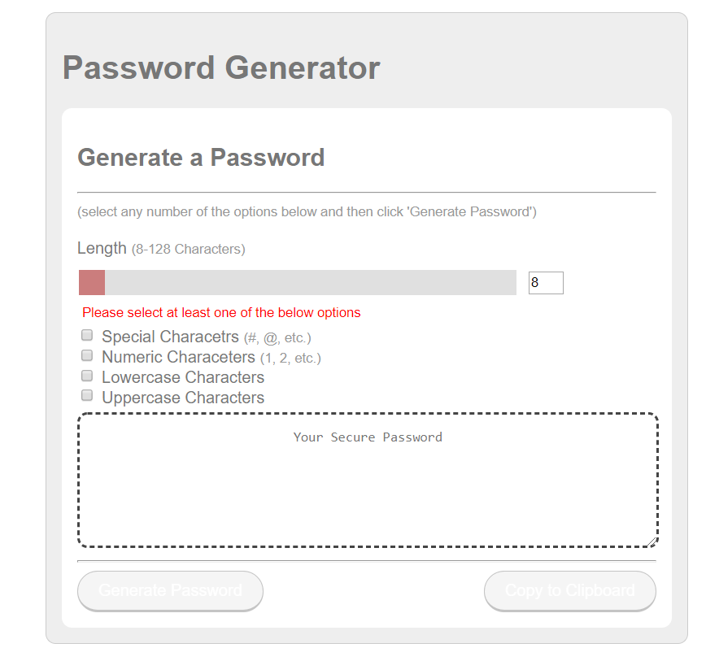

# Password Generator

## Description
This is a small web app to create a strong randomly generated password based on user selections using a simple interface with the bulk of the logic
being written in Javascript. HTML and CSS used to structure and style the page. Page built to be responsive without the use of external libraries.

## Installation

No installation required

## Usage 

Select a length for the password (default is 16 characters, minimum 8, maximum 128).
Then select at least one of the checkbox options:
-Use of special characters (further provides option to exlcude visiually ambiguous characters)
-Use of numerals
-Use of lower case letters
-Use of upper case letters
Generated passwords will include at least one character of each selected type.

Generate password button creates the password and outputs to the text box
Copy to clipboard will automatically put the password into the devices clipboard

## Credits

None

## License

MIT License

Copyright (c) 2019 Michael Hrivnak

Permission is hereby granted, free of charge, to any person obtaining a copy
of this software and associated documentation files (the "Software"), to deal
in the Software without restriction, including without limitation the rights
to use, copy, modify, merge, publish, distribute, sublicense, and/or sell
copies of the Software, and to permit persons to whom the Software is
furnished to do so, subject to the following conditions:

The above copyright notice and this permission notice shall be included in all
copies or substantial portions of the Software.

THE SOFTWARE IS PROVIDED "AS IS", WITHOUT WARRANTY OF ANY KIND, EXPRESS OR
IMPLIED, INCLUDING BUT NOT LIMITED TO THE WARRANTIES OF MERCHANTABILITY,
FITNESS FOR A PARTICULAR PURPOSE AND NONINFRINGEMENT. IN NO EVENT SHALL THE
AUTHORS OR COPYRIGHT HOLDERS BE LIABLE FOR ANY CLAIM, DAMAGES OR OTHER
LIABILITY, WHETHER IN AN ACTION OF CONTRACT, TORT OR OTHERWISE, ARISING FROM,
OUT OF OR IN CONNECTION WITH THE SOFTWARE OR THE USE OR OTHER DEALINGS IN THE
SOFTWARE.
